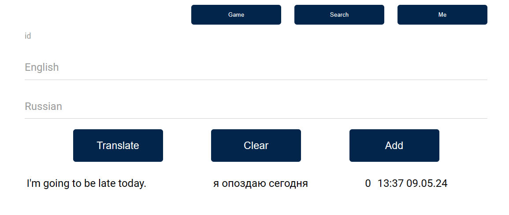
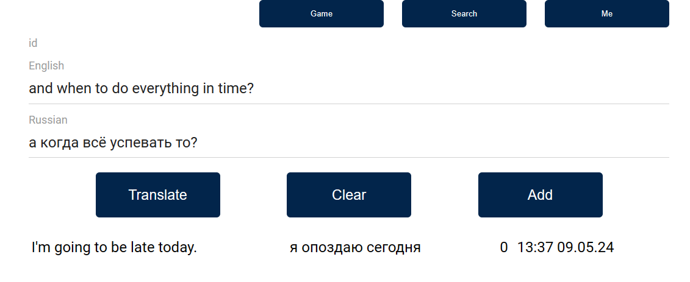
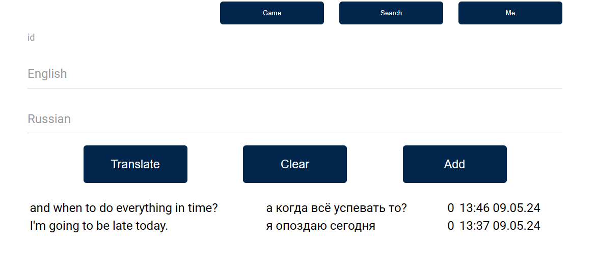

## Веб приложение для запоминая перевода слов и словосочетаний





### Идея:
- собственное бесплатное приложение переводчик с историей переводов
- интерактивные игры для запоминания


### Решает проблемы:

- Сложность поиска нужного слова. Если слова записаны в хронологическом порядке, то может быть сложно найти требуемое слово в нужный момент.  
- Нет удобного способа повторения слов. Естественно нет случайного выбора. 
- Нет возможности воспроизвести произношение слова. А записывание транскрипции требует отдельных навыков и попросту неудобно
- Нет доступа в любое время. Тогда как смартфон допустим доступен в любое время. 
- Сложно отслеживать прогресс в изучении слов. 
- Сложно поддается масштабированию. 
- Спешка. Новые слова часто записываются во время урока в спешке.  

Реализовано на Thymeleaf, но так же в разработке REST составляющая (она будет основной)


### Основная функциональность приложения включает в себя:
- Онлайн перевод с последующим запоминанием слов и словосочетаний в любом направлении. С английского на русский и с русского на английский.
- для заучивания слов реализован функционал игр с повторениями
- Ведение статистики по изучению слов. И повторение слов, которые имели не удалось запомнить. 
- Для перевода поступающих слов и словосочетаний осуществлено подключение к GoogleTranslate и ЯндексTranslate. 
- Также существует оффлайн база данных слов.
- Реализован функционал авторизации. Каждый пользователь имеет собственную базу слов, но они будут использованы и в общей игре

### Функционал который будет дорабатываться далее: 

- Загрузка схематичных изображений в качестве подсказок к словам.  
- Систематизация категорий слов.
- Проигрывание английской речи. 
- Голосовой ввод и голосовая проверка.  
- Коллективное редактирование записей по примеру Википедиию. 
- Таблицы форм глаголов для заучивания
- Поддержка иных языков с рефакторингом для унификации


### База данных разворачивается автоматически (главное чтобы был установлен Docker)
[compose.yaml](compose.yaml)
```yaml
services:
  postgres:
    container_name: dictionary
    image: postgres:latest
    environment:
      - POSTGRES_DB=dictionary
      - POSTGRES_PASSWORD=5565
      - POSTGRES_USER=richard
    volumes:
      - dictionary:/var/lib/postgresql/data
    ports:
      - 5565:5432
volumes:
  dictionary:
```

#### Этапы начального заполнения:
Локальный словарик на основе txt файла: 
```java
public class InitDatabase {
    private final TranslationRepository repository;
    private final String initFilePath = "src/main/resources/dictionary.txt";
    @EventListener(ContextRefreshedEvent.class)
    private void initDatabase() {

        List<Translation> list = new ArrayList<>();
        if (!repository.findAll().isEmpty()) return;

        try (BufferedReader br = new BufferedReader(new FileReader(initFilePath))) {
            String line;
            while ((line = br.readLine()) != null) {
                var translation = parseLineToTranslation(line);
                list.add(translation);
            }
        } catch (IOException e) {
            log.error("PLEASE CHECK NAME OF FILE" + e.getMessage());
        }
        log.info("List have been loaded");
        repository.saveAll(list);
        log.info("Database has been loaded");
    }

    private Translation parseLineToTranslation(String line) {
        String[] parts = line.replace("\\\"", "").split(";");
        if (parts.length == 2)
            return Translation.builder()
                    .englishExpression(parts[0])
                    .russianExpression(parts[1])
                    .build();
        return Translation.builder()
                .englishExpression(parts[0])
                .englishTranscription(parts[1])
                .russianExpression(parts[2])
                .build();
```

Инициализация пользователей: 
```java
@Service
@RequiredArgsConstructor
public class UserService {
    private final UserRepository userRepository;
    private final PasswordEncoder passwordEncoder;

    ...
    
    @EventListener(ContextRefreshedEvent.class)
    private void createUsers() {

        if (userRepository.getUserByName("user").isEmpty()) {
            var user = User.builder()
                    .name("user")
                    .email("User@mail.com")
                    .password(passwordEncoder.encode("12345"))
                    .roles(Collections.singleton(Role.USER))
                    .build();
            userRepository.save(user);
        }
        if (userRepository.getUserByName("root").isEmpty()) {
            var root = User.builder()
                    .name("root")
                    .email("Root@mail.com")
                    .password(passwordEncoder.encode("godMode"))
                    .roles(Collections.singleton(Role.ADMIN))
                    .build();
            userRepository.save(root);
        }
    }
}
```

